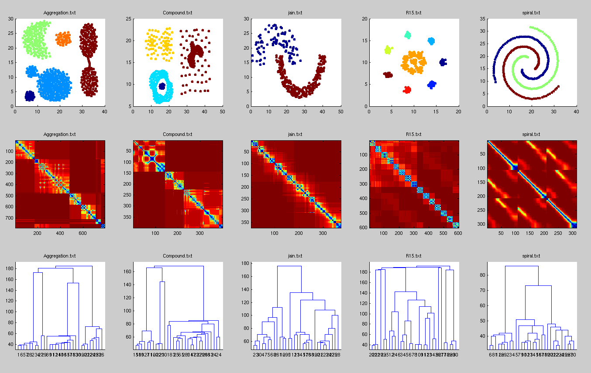

# Evidence Accumulation Clustering

Matlab implementation of Evidence Accumulation Clustering (EAC) algorithm.
Code based on original post with
R-code ["The Wisdom of Crowds - Clustering Using Evidence Accumulation Clustering"](http://things-about-r.tumblr.com/post/43894016034/the-wisdom-of-crowds-clustering-using-evidence)

For more information about algorithm see article [ Fred,Jain "Data Clustering Using Evidence Accumulation"](http://www.lx.it.pt/~afred/anawebit/articles/AFred_AJain_ICPR2002.pdf)

Clustering Datasets [link](http://cs.joensuu.fi/sipu/datasets/)

==========================

